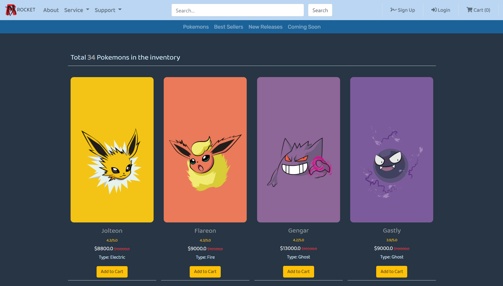

# Pokemon-Shop-Spring
This project is a RESTful Java web service of [Pokemon e-commerce website](https://github.com/wontaekoh/Pokemon-Shop).

**Features:**
- User authentication (login and logout)
- User Create, Read, Update, and Delete
- Product Read and Delete

**Future Tasks:**
- Adding product create and update functions
- Adding product search function

 

### Technologies Used:
- Spring Boot framework
- Spring Security for user authentication
- Spring MVC
- Spring Data JPA & Hibernate for data access
- Thymeleaf as a template engine
- MySQL JDBC driver

 

### Project Demonstration: 
Click the image below to watch the project demo
  

 

### References:
Images: https://shey.tistory.com/category/Wallpapers/%ED%8F%AC%EC%BC%93%EB%AA%AC%EC%8A%A4%ED%84%B0?page=2

Pokemon Descriptions: https://bulbapedia.bulbagarden.net/wiki/List_of_Pok%C3%A9mon_by_National_Pok%C3%A9dex_number
