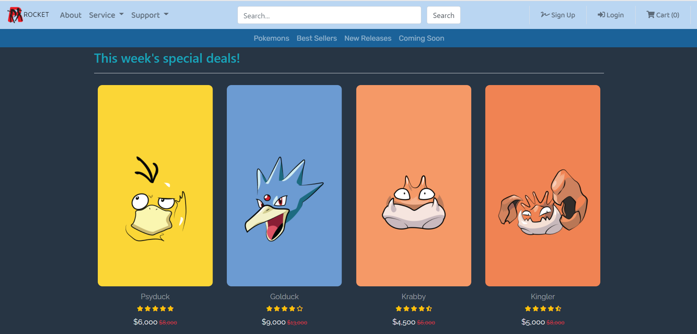

# Pokemon-Shop-Spring
This project is a RESTful Java web service of [Pokemon e-commerce website](https://github.com/wontaekoh/Pokemon-Shop).

**Features added:**
- User authentication (login and logout)
- User Create, Read, Update, and Delete
- Product Read and Delete

**Future tasks:**
- Adding product create and update functions
- Adding product search function

 

### Technologies used:
- Spring Boot framework
- Spring Security for user authentication
- Spring MVC
- Spring Data JPA & Hibernate for data access
- Thymeleaf as a template engine
- MySQL JDBC driver

 

### Project Demonstration:
<!-- [![Anonymous User's View]](https://j.gifs.com/0Yw3k5.gif) -->

<!-- <figure class="video_container">
  <video controls="true" allowfullscreen="true" poster="demo-images/anonymous.png">
    <source src="demo-images/anonymous-view.mp4" type="video/mp4">
  </video>
</figure> -->

<!-- <figure class="video_container">
  <iframe src="https://drive.google.com/file/d/10Iyl7gXYfkRylYYRVMHhF-2Akf4OC7bB/view?usp=sharing" frameborder="0" allowfullscreen="true"> </iframe>
</figure> -->

 

### References:
Images: https://shey.tistory.com/category/Wallpapers/%ED%8F%AC%EC%BC%93%EB%AA%AC%EC%8A%A4%ED%84%B0?page=2

Pokemon Descriptions: https://bulbapedia.bulbagarden.net/wiki/List_of_Pok%C3%A9mon_by_National_Pok%C3%A9dex_number
